# Manual de Usuario - Gestor QA

## 1. Objetivo

Este manual explica como usar el Gestor QA para registrar, consultar y dar seguimiento al trabajo del equipo de QA. La aplicacion centraliza tareas, errores, lotes/microservicios, casos de prueba, miembros del equipo e indicadores de desempeno.

URL de produccion: https://project-agents-app-gestor-qa.vercel.app/

## 2. Inicio de sesion

Al ingresar a la URL de produccion se muestra la pantalla de acceso. Usa tu correo corporativo y la contrasena asignada por el administrador.

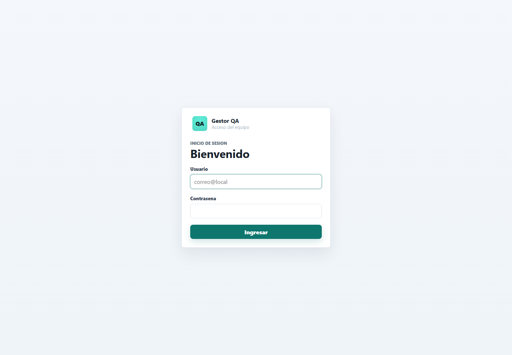

Pasos:

1. Ingresa tu correo en el campo `Usuario`.
2. Ingresa tu contrasena.
3. Haz clic en `Ingresar`.

## 3. Navegacion principal

El menu lateral permite moverse entre las secciones de la aplicacion:

- `Tablero`: vista general, metricas y flujo de trabajo tipo canvas.
- `Indicadores`: indicadores operativos y KPIs mensuales.
- `Tareas`: gestion detallada de tareas.
- `Lotes y funcionalidades`: seguimiento tecnico de microservicios y SPs.
- `Casos de prueba`: control de casos y evidencias de validacion.
- `Errores`: registro y seguimiento de incidencias.
- `Miembros QA`: administracion del equipo.
- `Configuracion`: catalogos y opciones configurables.

## 4. Tablero QA

El tablero muestra metricas generales y el flujo de trabajo del equipo. Las tarjetas se organizan por estado: `Por hacer`, `En progreso`, `En revision` y `Finalizado`.

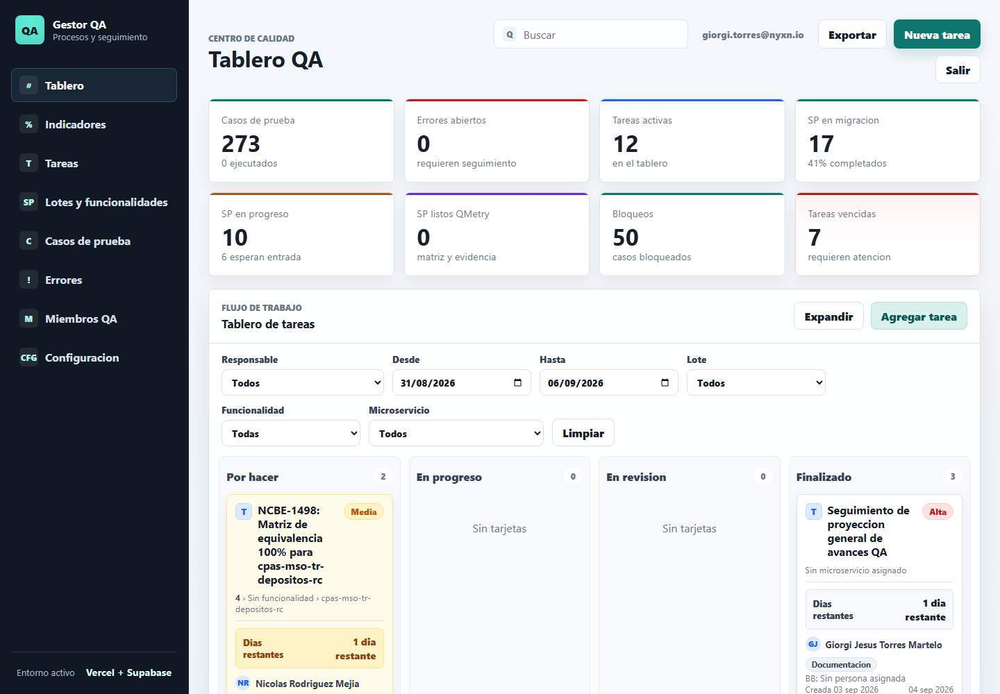

En el canvas puedes:

- Filtrar por responsable, fechas, lote, funcionalidad o microservicio.
- Abrir una tarjeta haciendo clic sobre ella.
- Arrastrar tarjetas entre columnas para cambiar su estado.
- Identificar rapidamente el tipo de tarjeta:
  - `T`: tarea.
  - `!`: error.

Ejemplo de tarjeta de error en el canvas:

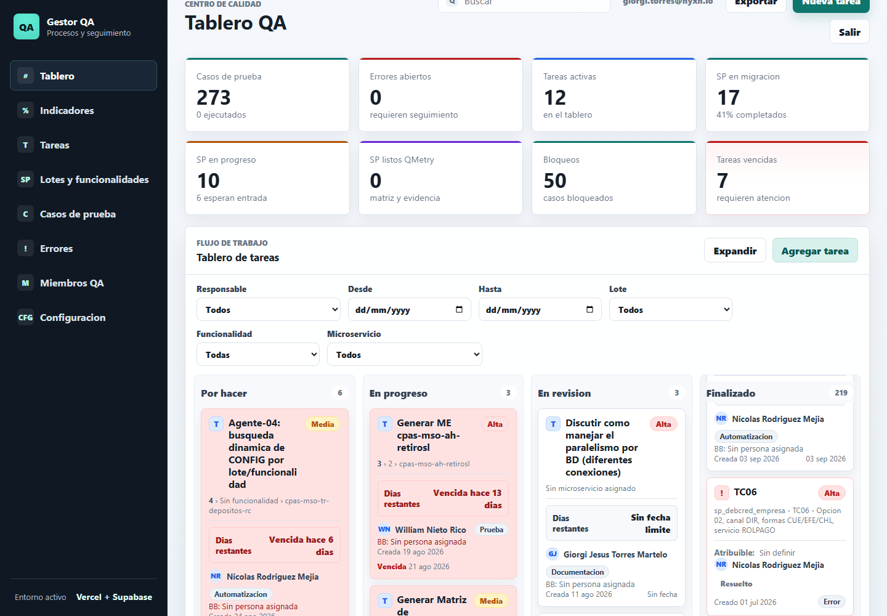

Las tareas muestran un bloque visible de `Dias restantes`. Si faltan 2 dias o menos para vencer, la tarjeta se resalta en amarillo claro. Si ya esta vencida, se marca en rojo.

## 5. Indicadores

La pestana `Indicadores` tiene dos vistas:

- `Operativos`: metricas generales por alcance.
- `KPIs`: reporte mensual de desempeno por persona.

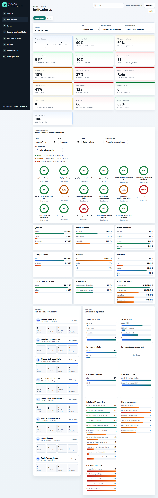

## 6. KPIs Mensuales

En la pestana `KPIs` selecciona el mes a consultar desde el selector `Mes / Ano`. Por defecto se muestra el mes actual.

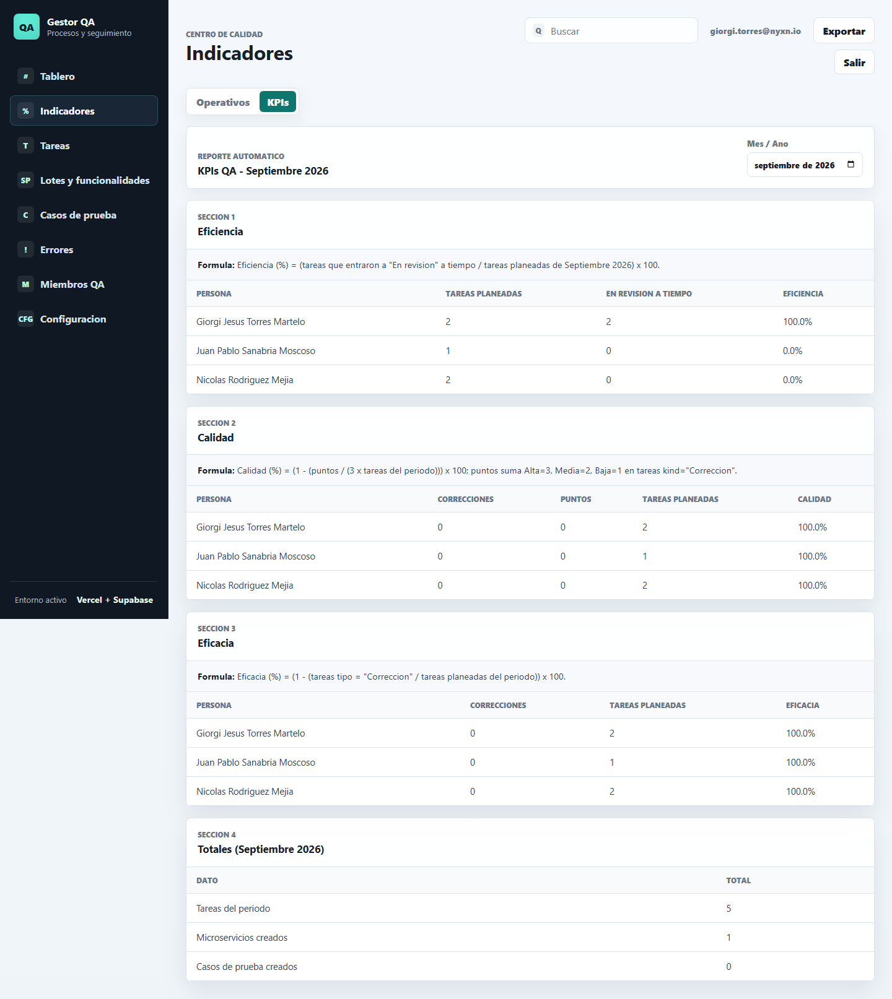

Los KPIs se calculan con tareas de la tabla `tasks` cuyo `dueDate` pertenece al periodo seleccionado.

Formulas:

- `Eficiencia = (tareas que entraron a En revision o Done a tiempo / tareas planeadas del periodo) x 100`.
- `Calidad = (1 - (puntos de correcciones / (3 x tareas planeadas del periodo))) x 100`.
- `Eficacia = (1 - (tareas tipo Correccion / tareas planeadas del periodo)) x 100`.

Reglas importantes:

- Una tarea cuenta a tiempo si su entrada a `En revision` o `Done` es menor o igual a `dueDate`.
- Las tareas tipo `Correccion` descuentan calidad y eficacia.
- Para calidad, las correcciones pesan por prioridad: `Alta = 3`, `Media = 2`, `Baja = 1`.
- Al hacer clic sobre una persona en una tabla KPI se abre el detalle auditable de las tareas usadas en el calculo.

## 7. Tareas

La seccion `Tareas` permite consultar, filtrar, crear y editar tareas del equipo.

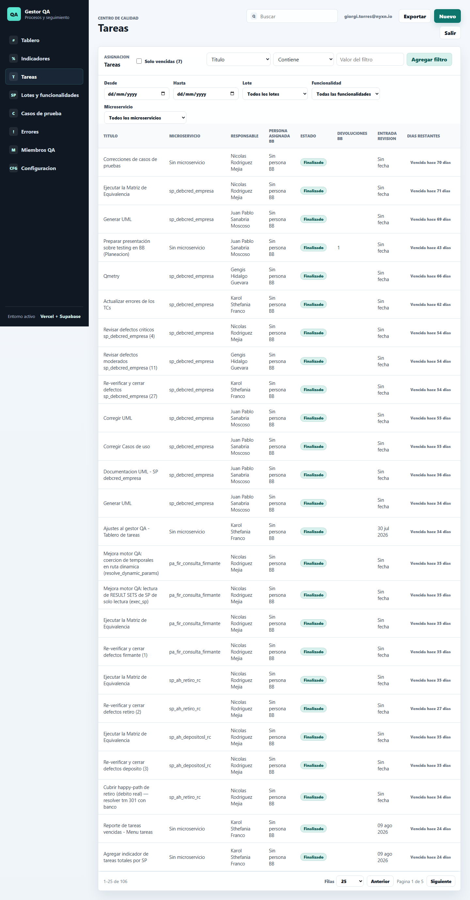

Campos principales:

- `Titulo`: nombre de la tarea.
- `Microservicio`: servicio o componente asociado.
- `Responsable`: miembro QA asignado.
- `Persona asignada BB`: persona asignada por Banco Bolivariano.
- `Estado`: estado actual de la tarea.
- `Devoluciones BB`: cantidad de devoluciones registradas.
- `Fecha limite`: fecha usada para vencimientos, dias restantes y KPIs.
- `Link Jira`: enlace a la tarea en Jira.
- `Tipo`: clasificacion de la tarea, por ejemplo `Prueba`, `Documentacion`, `Automatizacion` o `Correccion`.
- `Descripcion`: contexto o alcance de la tarea.

Formulario de tarea:

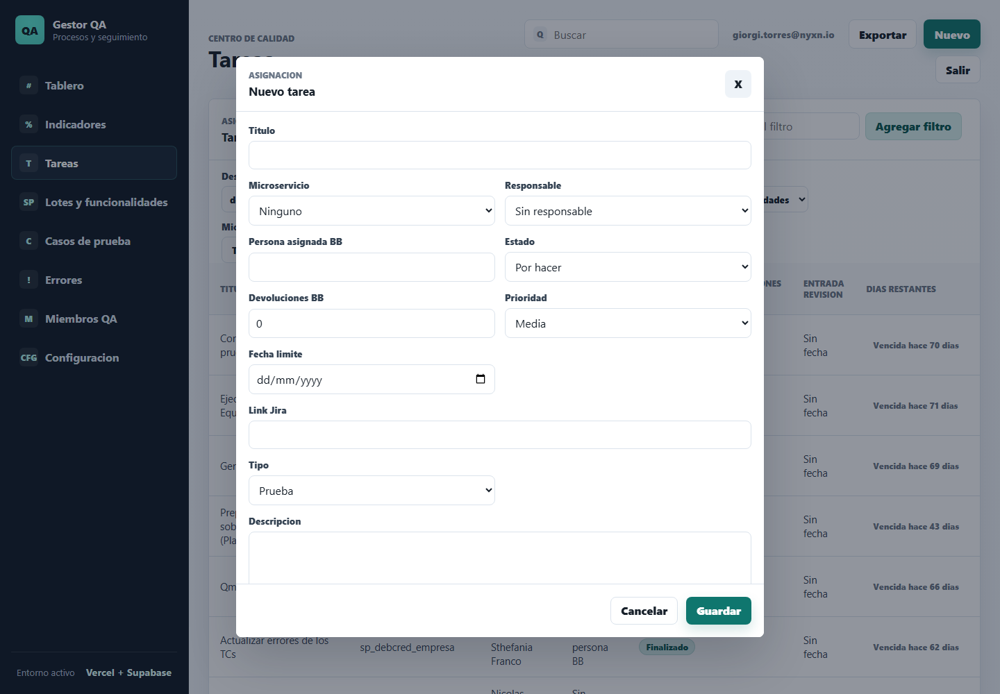

Notas:

- Si una tarea entra a `En revision`, el sistema registra la fecha de entrada a revision.
- `Devoluciones BB` exige una descripcion por cada devolucion registrada.
- El campo `Dias restantes` se calcula automaticamente desde la fecha limite.

## 8. Lotes y Funcionalidades

Esta seccion permite gestionar lotes, funcionalidades, microservicios y SPs asociados al proceso de migracion.

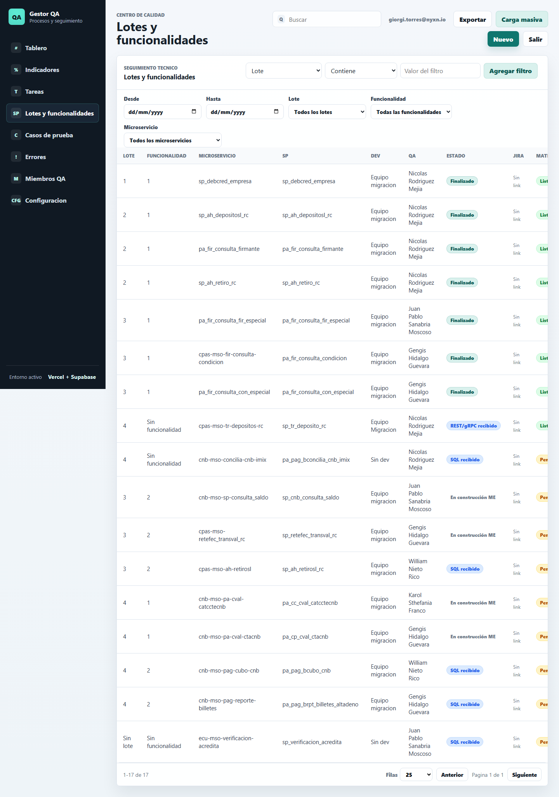

Se usa para relacionar tareas, casos de prueba y errores con un alcance tecnico especifico.

## 9. Casos de Prueba

La seccion `Casos de prueba` permite administrar los casos usados durante la validacion.

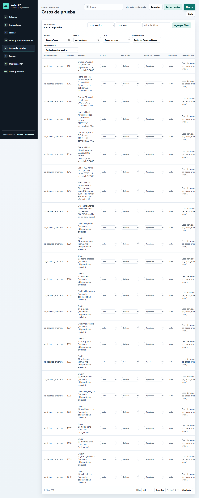

Campos habituales:

- `Microservicio`.
- `Codigo`.
- `Nombre`.
- `Estado`.
- `Ejecucion`.
- `Aprobado Banco`.
- `Prioridad`.
- `Observacion`.
- `Pasos`.
- `Resultado esperado`.

## 10. Errores

La seccion `Errores` permite registrar incidencias encontradas durante las pruebas.

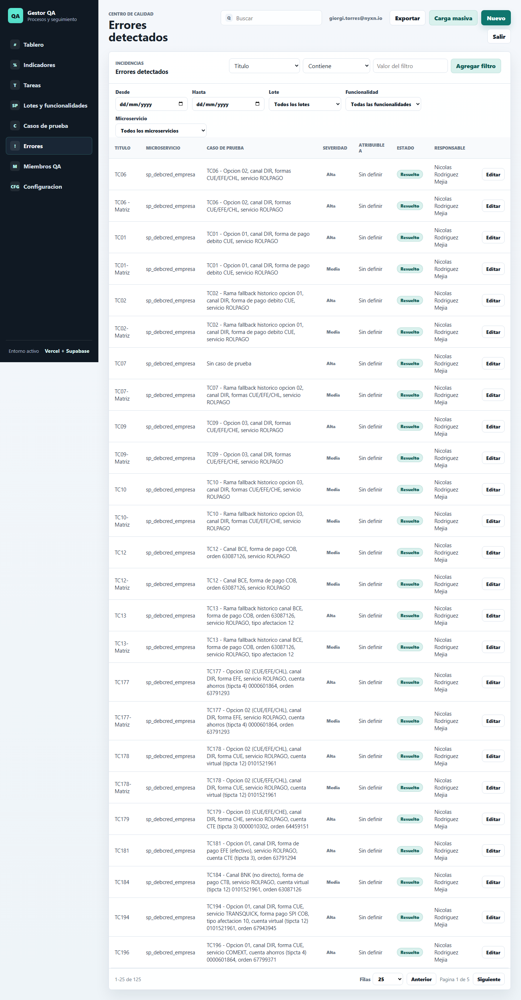

Formulario de error:

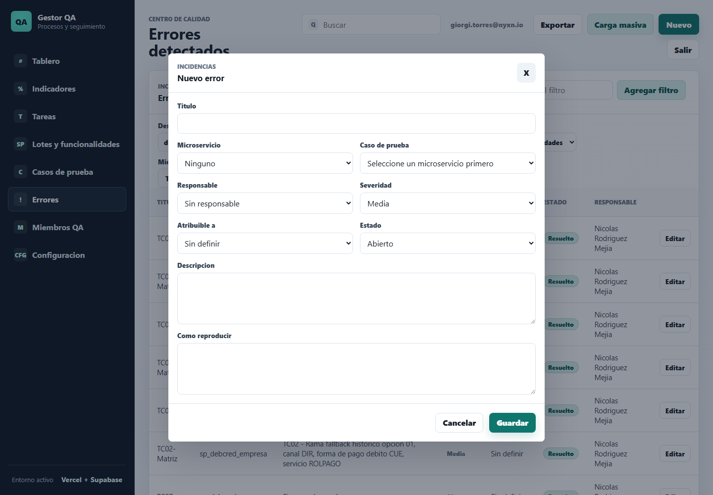

Campos principales:

- `Titulo`: resumen del error.
- `Microservicio`: componente afectado.
- `Caso de prueba`: caso donde se detecto el error.
- `Responsable`: QA que da seguimiento.
- `Severidad`: criticidad del error.
- `Atribuible a`: origen probable del error. Opciones iniciales:
  - `Banco Bolivariano`.
  - `Migracion Dev NYXN`.
  - `Tester`.
- `Estado`: estado del error.
- `Descripcion`: detalle del problema.
- `Como reproducir`: pasos para evidenciar el error.

Los errores tambien se visualizan en el canvas del tablero con el icono `!`.

## 11. Miembros QA

La seccion `Miembros QA` permite consultar y administrar el equipo registrado.

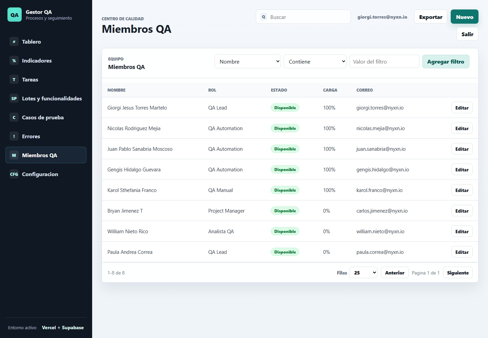

Los miembros se usan como responsables en tareas, errores y calculos KPI.

## 12. Configuracion

La seccion `Configuracion` permite administrar catalogos del sistema, como estados, prioridades, severidades y listas configurables.

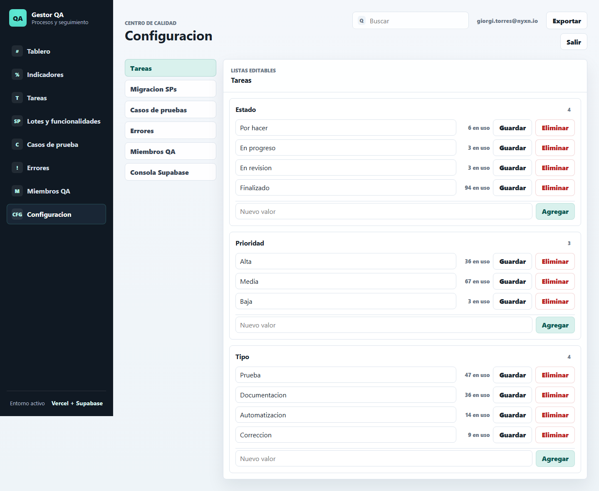

Usa esta seccion con cuidado, porque modificar catalogos puede afectar filtros, formularios e indicadores.

## 13. Buenas practicas de uso

- Registra siempre `Fecha limite` en tareas para que KPIs y vencimientos funcionen correctamente.
- Manten actualizado el estado de las tareas.
- Cuando una tarea llegue a revision, muevela a `En revision` para que cuente en eficiencia.
- Usa `Correccion` solo cuando la tarea represente una correccion real.
- Registra `Devoluciones BB` con su descripcion correspondiente.
- En errores, completa `Atribuible a` para poder analizar origen de incidencias.
- Usa filtros antes de exportar o auditar informacion.
